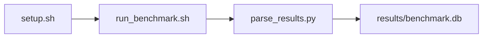

# BERT Inference Sweep Benchmark

[](LICENSE)
[](https://github.com/garys-gpu-benchmarks/423-gpu-bench-nvidia-bert-base-inference-ubu2604/actions/workflows/ci.yml)

Target: Ubuntu 26.04 · NVIDIA · see Hardware Requirements. This is a host benchmark, not a laptop `pip install` project.

## Quick Start

```bash
git clone https://github.com/garys-gpu-benchmarks/423-gpu-bench-nvidia-bert-base-inference-ubu2604.git
cd 423-gpu-bench-nvidia-bert-base-inference-ubu2604
sudo bash setup.sh --assume-yes
bash run_benchmark.sh --profile smoke --validate
```
Results are written to `results/benchmark.db` and `results/summary.json`.

This workload is executed on the validation host after the repository is copied there. `setup.sh` and `run_benchmark.sh` do not open an outbound SSH session.

Prerequisites: Ubuntu 26.04; NVIDIA; Python 3.14.4; root or sudo for `setup.sh`. Framework: Bash, SQLite, Python, PyYAML, CUDA Runtime, PyTorch-CUDA, Hugging Face Transformers, BERT. Set HF_TOKEN when the model license requires a Hugging Face token. This is a host benchmark, not a laptop `pip install` project.



## 1. Overview

Runs gpu-bench-bert-transformers-inference.py with Hugging Face bert-base-uncased on synthetic token batches (PyTorch, not TensorFlow). model_name, sequence_len, batch_size, warmup_iters, num_iterations, and precision mixed_float16 / f16_r come from yaml. Collector runs the script twice (pass1/pass2/summary) Sweep dimensions: model_name, dtype, precision, num_gpus, prompt_source, sequence_len, batch_size, warmup_iters.

## 2. What It Validates

- Validates Hugging Face BERT inference throughput and latency. This is not tf.keras
- #1: Inference throughput (sequences_per_sec); is present and physically sensible.
- #2: Inference latency, mean step time, ms (mean_latency_ms); is present and physically sensible.
- #3: Token throughput (tokens_per_sec); is present and physically sensible.
- #4: Peak GPU memory (peak_gpu_memory_gb) is present and physically sensible.

## 3. Metrics Captured

- **#1: Inference throughput** — stored as `sequences_per_sec`.
- **#2: Inference latency, mean step time, ms** — stored as `mean_latency_ms`.
- **#3: Token throughput** — stored as `tokens_per_sec`.
- **#4: Peak GPU memory** — stored as `peak_gpu_memory_gb`.

## 4. Hardware Requirements

### Supported environment

- OS: Ubuntu 26.04
- GPU vendor: NVIDIA
- Framework family: Bash, SQLite, Python, PyYAML, CUDA Runtime, PyTorch-CUDA, Hugging Face Transformers, BERT
- Python: Python 3.14.4

### Reference validation environment

The tables below describe the machine used to generate the reference results. They are not a requirement that every user buy that exact cloud instance.

### System

Runs gpu-bench-bert-transformers-inference.py with Hugging Face bert-base-uncased on synthetic token batches (PyTorch, not TensorFlow). model_name, sequence_len, batch_size, warmup_iters, num_iterations, and precision mixed_float16 / f16_r come from yaml. Collector runs the script twice (pass1/pass2/summary)

### GPU

Ubuntu 26.04 / NVIDIA / Bash, SQLite, Python, PyYAML, CUDA Runtime, PyTorch-CUDA, Hugging Face Transformers, BERT

## 5. Software Requirements

| Component | Version |
|---|---|
| OS | Ubuntu 26.04 |
| Kernel | kernel 7.0.0 |
| Python | Python 3.14.4 |
| ROCm | CUDA 13.3 |
| rocBLAS | N/A - rocBLAS not used |

Runs gpu-bench-bert-transformers-inference.py with Hugging Face bert-base-uncased on synthetic token batches (PyTorch, not TensorFlow). model_name, sequence_len, batch_size, warmup_iters, num_iterations, and precision mixed_float16 / f16_r come from yaml. Collector runs the script twice (pass1/pass2/summary)

## 6. Installation

```bash
Run gpu-bench-bert-transformers-inference.py via collect_bert_infer.py
```

## 7. Running the Benchmark

```bash
Run gpu-bench-bert-transformers-inference.py via collect_bert_infer.py
```

**Validating results separately:**

```bash
export BENCHMARK_PYTHON=/usr/bin/python3.13  # optional
python3 -m venv .venv
source ".venv/bin/activate"
".venv/bin/python" scripts/validate_results.py
```

## 8. Output

### `results/benchmark.db` (SQLite)

raw_results.csv with pass1, pass2, and summary from two runs of the BERT inference script

check,model_name,sequence_len,batch_size,status,sequences_per_sec,mean_latency_ms,latency_p50_msec,latency_p99_msec,tokens_per_sec,peak_gpu_memory_gb
pass1,bert-base-uncased,128,8,ok,40,200,190,220,5120,4

```bash
Run gpu-bench-bert-transformers-inference.py via collect_bert_infer.py
```

### `results/summary.json`

Consolidated metrics from the most recent run — suitable for CI artifact upload or dashboard ingestion.

### `results/raw/<timestamp>.txt`

raw_results.csv with pass1, pass2, and summary from two runs of the BERT inference script

check,model_name,sequence_len,batch_size,status,sequences_per_sec,mean_latency_ms,latency_p50_msec,latency_p99_msec,tokens_per_sec,peak_gpu_memory_gb
pass1,bert-base-uncased,128,8,ok,40,200,190,220,5120,4

## 9. Baselines / Thresholds

Expected ranges and gates live in `config/benchmark_config.yaml` under `baselines:` or `thresholds:`. To update them, edit that file — never edit validation code directly.

## 10. Troubleshooting

**`setup.sh` missing collector**
Create cannot finish without `scripts/collect_workload.py`.

**`self_check` overlay rewritten**
Do not overwrite files listed in `results/overlay_lock.json`.

**Remote SSH drop during setup**
Reconnect and resume `bash setup.sh --assume-yes`. Do not wipe `.venv` or `.cache`.

## 11. NVIDIA H100 Coding Differences

Native NVIDIA CUDA workload. Execute on the stated Ubuntu release with the host NVIDIA driver and CUDA userspace. ROCm porting notes do not apply.

## Repository layout

```text
.
├── setup.sh
├── run_benchmark.sh
├── benchmark_specification.json
├── .github/workflows/      # thin CI callers (see Continuous Integration)
├── config/
├── scripts/
├── src/
├── tests/
├── docs/
├── results/
└── LICENSE
```

## Continuous Integration

| Workflow | Runs on | When | What it does |
|---|---|---|---|
| [CI](.github/workflows/ci.yml) | GitHub-hosted runner | every pull request, and every push to `main` | shellcheck, ruff, `bash -n`, `compileall`, `run_benchmark.sh --help`, specification schema, the results validator on a seeded fixture, required files, and actionlint. No GPU and no benchmark run. |
| [GPU Smoke Benchmark](.github/workflows/gpu-smoke.yml) | self-hosted runner labeled `gpu`, `nvidia`, `ubu2604` | only when started by hand: **Actions → GPU Smoke Benchmark → Run workflow** (choose `smoke`, `baseline` or `extended`) | Verifies the pre-provisioned GPU stack, records `results/environment.json` (driver, runtime, kernel, GPU), runs the profile with `--validate`, shows headline metrics on the run page, and uploads the results. |

Both files are short callers. The steps themselves live once, for every workload in the suite, in [`garys-gpu-benchmarks/shared-workflows`](https://github.com/garys-gpu-benchmarks/shared-workflows), pinned at `@v1`. The GPU workflow is never triggered by pull requests, so code from a fork cannot run on the GPU host.

### Running it as part of the NVIDIA Ubuntu 26.04 bundle

This repository is one of the 32 workloads in [`bundle-nvidia-ubuntu-2604`](https://github.com/garys-gpu-benchmarks/bundle-nvidia-ubuntu-2604), which holds them as git submodules. To put the whole bundle on a GPU host and run this workload from it:

```bash
git clone --recurse-submodules https://github.com/garys-gpu-benchmarks/bundle-nvidia-ubuntu-2604 /opt/benchmarks
cd /opt/benchmarks/423-gpu-bench-nvidia-bert-base-inference-ubu2604
bash run_benchmark.sh --profile smoke --validate
```
